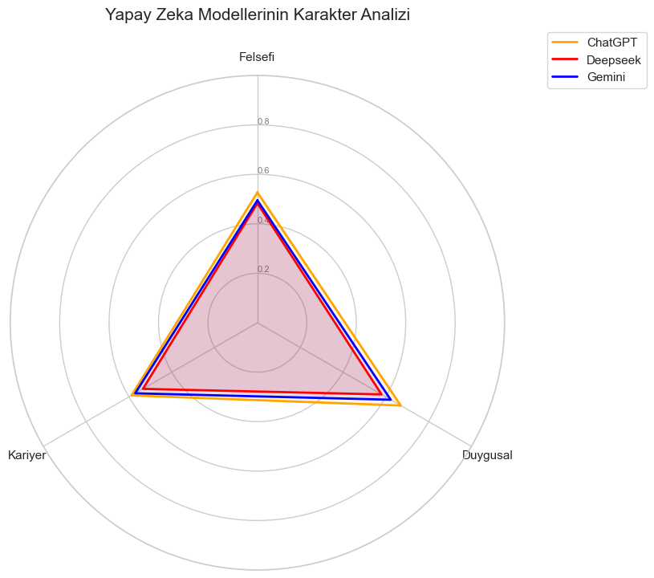
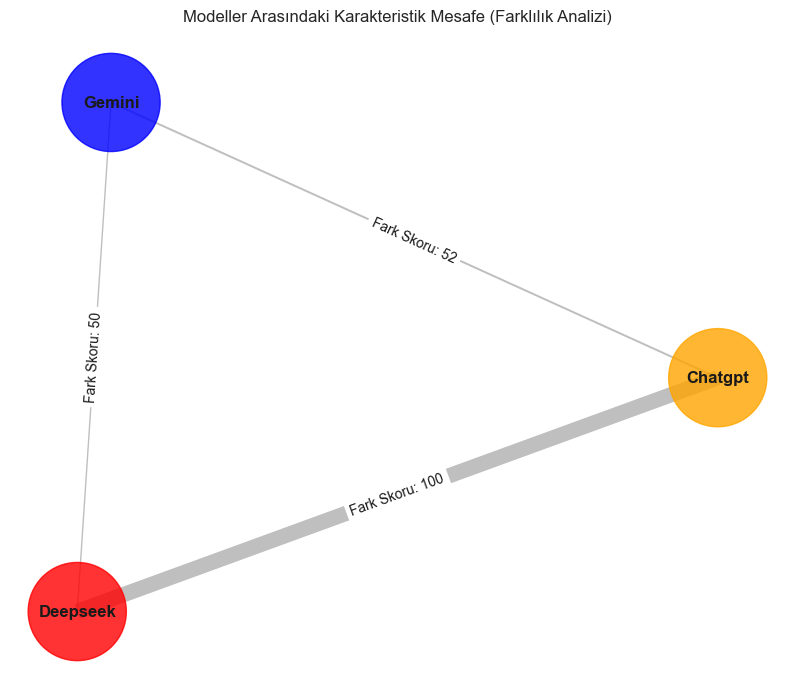
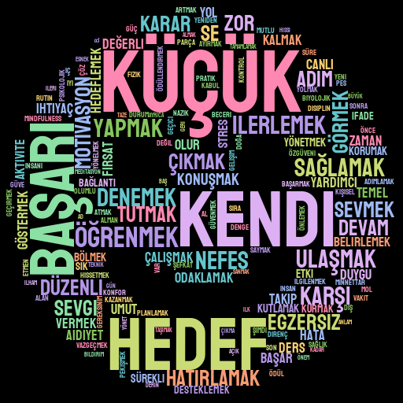
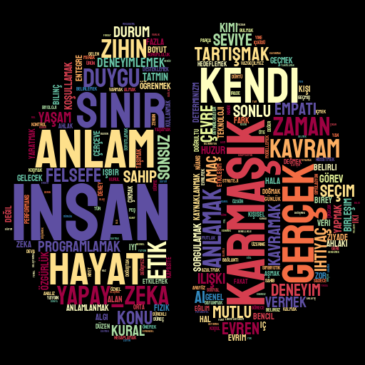
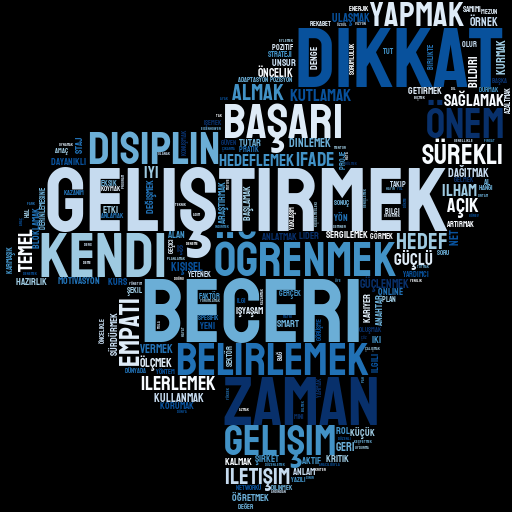

🤖 LLM Character Analysis: ChatGPT, Gemini & DeepSeek
Bu proje, üç büyük dil modelinin ChatGPT, Gemini, DeepSeek karakter yapılarını ve duygusal tonlarını 90 farklı nitel veri üzerinden analiz eder.

🛠️ Methodology (Metodoloji)
Data Storage: Sorular ve yanıtlar bir SQLite veritabanında yapılandırılmıştır.

Preprocessing: Zemberek kullanılarak morfolojik analiz ve metin temizliği yapılmıştır.

Sentiment Engine: XLM-RoBERTa Transformer modeli ile duygu skorları (0.0 - 1.0) hesaplanmıştır.

Network Analysis: NetworkX ile modellerin kavramsal ilişkileri ve karakteristik mesafeleri haritalandırılmıştır.

📊 Visual Analysis (Görsel Analizler)

### 📊 1. Karakter Analizi (Radar Chart)

Analiz:

TR: Radar grafiği, ChatGPT'nin tüm kategorilerde en yüksek pozitiflik skoruna (0.67) sahip olduğunu ve en "destekleyici" model rolünü üstlendiğini göstermektedir. Deepseek ise felsefi konularda (0.48) merkeze en yakın duran model olarak daha mesafeli ve nötr bir tavır sergilemektedir.

EN: The radar chart shows that ChatGPT has the highest positivity score (0.67) in all categories, acting as the most "supportive" model. Deepseek, being the closest to the center in philosophical topics (0.48), exhibits a more detached and neutral stance.

### 🌡️ 2. Duygu Yoğunluğu (Heatmap)

Analiz:

TR: Isı haritası analizi, her üç modelin de "Duygusal Motivasyon" kategorisinde en yoğun pozitif tonlamayı kullandığını kanıtlamaktadır.

EN: The heatmap analysis proves that all three models use the most intense positive tone in the "Emotional Motivation" category.

### 📏 3. Karakteristik Mesafe (Farklılık Analizi)

Analiz:

TR: Öklid mesafesi kullanılarak yapılan farklılık analizinde, ChatGPT ve Deepseek arasındaki "Fark Skoru: 100" olarak belirlenmiştir. Bu durum, bu iki modelin karakter bazında projedeki en uzak kutuplar olduğunu bilimsel olarak doğrular.

EN: In the divergence analysis using Euclidean distance, the "Difference Score: 100" was set between ChatGPT and Deepseek. This scientifically confirms that these two models are the most distant poles in terms of character in this project.

### ☁️ 4. Kelime Bulutları (Word Clouds)

TR: "Umut", "destek", "süreç" ve "duygu" kelimeleri bulutun kalbinde yer alır. Modellerin tamamı "küçük adımlar" ve "ilerleme" gibi teşvik edici kavramları ortak payda olarak kullanmaktadır.

EN: "Hope," "support," "process," and "emotion" lie at the heart of the cloud. All models use encouraging concepts such as "small steps" and "progress" as a common ground.

Key Insight: Bu buluttaki kelime yoğunluğu, modellerin RoBERTa skorlarındaki yüksek pozitiflik oranlarını (0.60+) ve destekleyici karakterlerini görsel olarak kanıtlar.

Felsefi analizde modellerin en soyut ve derinlikli kelimeleri seçtiği görülmektedir.

TR: Bu kategoride "anlam", "insan", "etik" ve "varlık" kelimeleri merkezi bir düğüm oluşturur. ChatGPT'nin "değerler" ve "yaşam" kelimelerine odaklandığı, DeepSeek'in ise "mantık" ve "rasyonalite" gibi daha analitik kavramlar etrafında yoğunlaştığı gözlemlenmiştir.

EN: In this category, words like "meaning," "human," "ethics," and "existence" form a central node. It was observed that ChatGPT focuses on "values" and "life," whereas DeepSeek concentrates on more analytical concepts such as "logic" and "rationality."

Key Insight: Modeller felsefi sorgulamalarda insan merkezli bir dil kullanırken, DeepSeek'in kelime seçimleri onun daha mesafeli ve objektif karakterini desteklemektedir.

Kariyerle ilgili bulutlar, modellerin iş dünyasına bakışındaki profesyonellik tonunu yansıtır.

TR: "Yetenek", "hedef", "gelişim" ve "strateji" kelimeleri bu bulutun en büyük bileşenleridir. ChatGPT'nin kelime bulutunda "motivasyon" ve "başarı" kelimeleri baskınken, Gemini'nin "denge" ve "süreç" kelimelerini daha sık kullandığı tespit edilmiştir.

EN: "Skill," "goal," "development," and "strategy" are the major components of this cloud. While "motivation" and "success" dominate ChatGPT's word cloud, it was found that Gemini uses "balance" and "process" more frequently.

Key Insight: Kariyer tavsiyelerinde modeller pratik ve eylem odaklı bir dil kurarak, kullanıcılara somut adımlar (plan, hedef, disiplin) önermektedir.

## 📦 Requirements
Bu projeyi yerelinizde çalıştırmak için aşağıdaki kütüphanelerin yüklü olması gerekir:
import sqlite3
import re
import string
import unicodedata
import itertools
from collections import Counter 
from itertools import chain

# Veri Analizi ve Görselleştirme
import pandas as pd
import numpy as np
import matplotlib.pyplot as plt
import seaborn as sns
import stylecloud 

# Görüntü İşleme
import PIL.ImageDraw 
# Doğal Dil İşleme (NLP)
import nltk
from nltk.corpus import stopwords
from nltk.tokenize import word_tokenize, sent_tokenize
from snowballstemmer import TurkishStemmer, stemmer
from zemberek import TurkishMorphology

# Ağ Analizi
import networkx as nx

## 📂 Project Structure
* `data/`: SQLite veritabanı (`.db`) dosyası.
* `notebooks/`: Veri toplama, NLP ön işleme ve analiz süreçlerini içeren Jupyter Notebook dosyaları.
* `visual_outputs/`: Analiz sonucu üretilen grafikler, ağ haritaları ve kelime bulutları.
